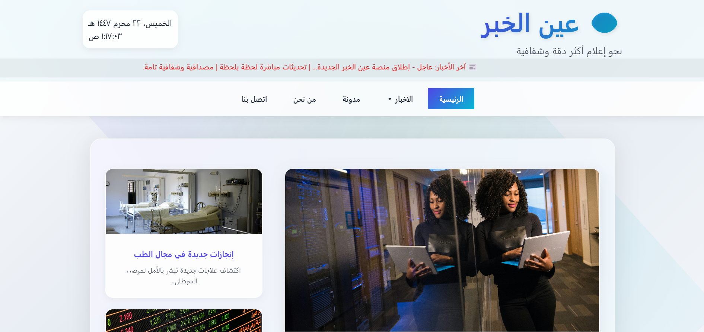
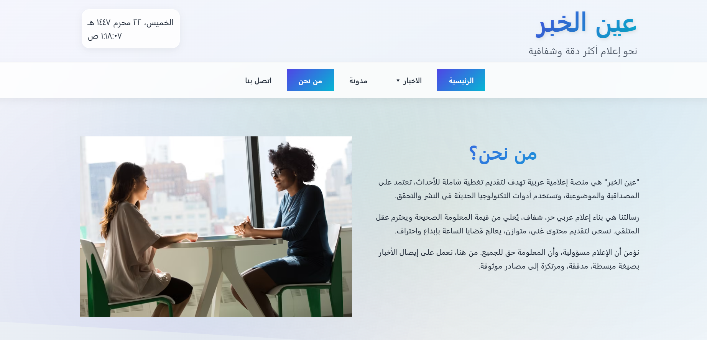
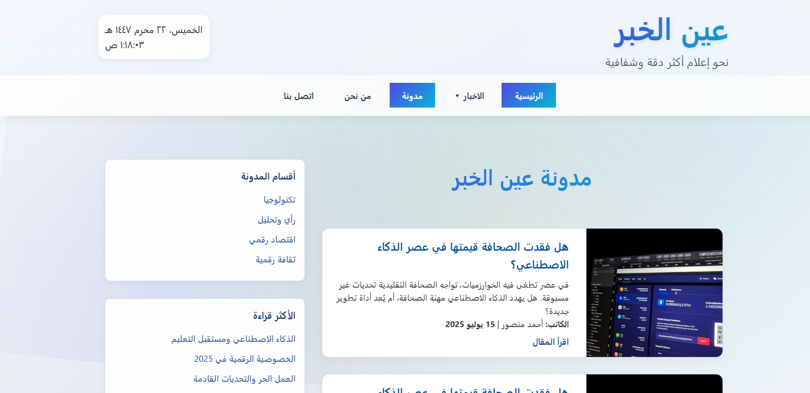
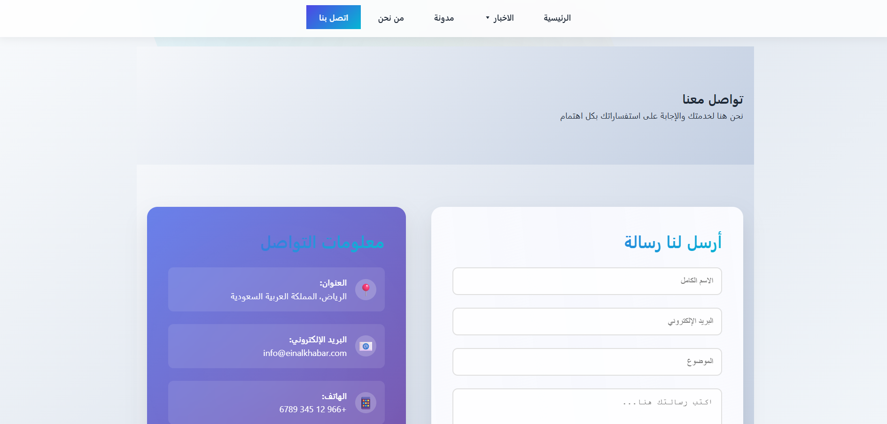

# 📰 عين الخبر | موقع إخباري عربي

**عين الخبر** هو موقع إخباري إلكتروني تم تطويره باستخدام تقنيات الويب الحديثة (HTML, CSS, JavaScript)، ويهدف إلى تقديم الأخبار والمقالات بطريقة احترافية، جذابة، وسهلة الاستخدام.

---

## 💡 فكرة المشروع

تم تصميم الموقع ليكون واجهة إخبارية بسيطة وسريعة الاستجابة، مع توزيع واضح للأقسام الإخبارية مثل:
- 🏠 الصفحة الرئيسية
- 🧑‍💼 من نحن
- 📝 المدونة
- 📬 تواصل معنا

---

## 🌐 التقنيات المستخدمة

- ✅ HTML5  
- ✅ CSS3 (تصميم متجاوب وحديث)  
- ✅ JavaScript (للتفاعل بين المستخدم والموقع)

---

## 📂 هيكل الصور

تم حفظ جميع الصور داخل المجلد:

### قائمة الصور:
- `home.png` — صورة توضح تصميم الصفحة الرئيسية  
- `about.png` — عرض لقسم من نحن  
- `blog.png` — نظرة على المدونة  
- `contact.png` — عرض صفحة التواصل  
- `eya.png` — شعار أو صورة رئيسية للموقع (عين الخبر)

---

## 📸 صور من الموقع

### 🏠 الصفحة الرئيسية  

---

### 👨‍💼 صفحة من نحن  

---

### ✍️ صفحة المدونة  

---

### 📩 صفحة تواصل معنا  

---

### 👁️ شعار "عين الخبر"  

---

## ✨ المميزات

- تصميم بسيط واحترافي  
- متجاوب مع جميع الشاشات  
- واجهة عربية 100%  
- سهولة التصفح بين الأقسام  
- استخدام النوافذ المنبثقة والعناصر التفاعلية

---

## 📈 أهداف مستقبلية

- ربط الموقع بنظام إدارة محتوى (CMS)  
- عرض الأخبار من مصادر حقيقية عبر API  
- إضافة نموذج اشتراك بالنشرة البريدية

---
## 🌐 العرض الحي

📡 [شاهد المشروع على GitHub Pages](https://waelzaqout.github.io/eyenews/index.html)

## 🧑‍💻 المطور

تم تطوير الموقع بواسطة: **وايل**
